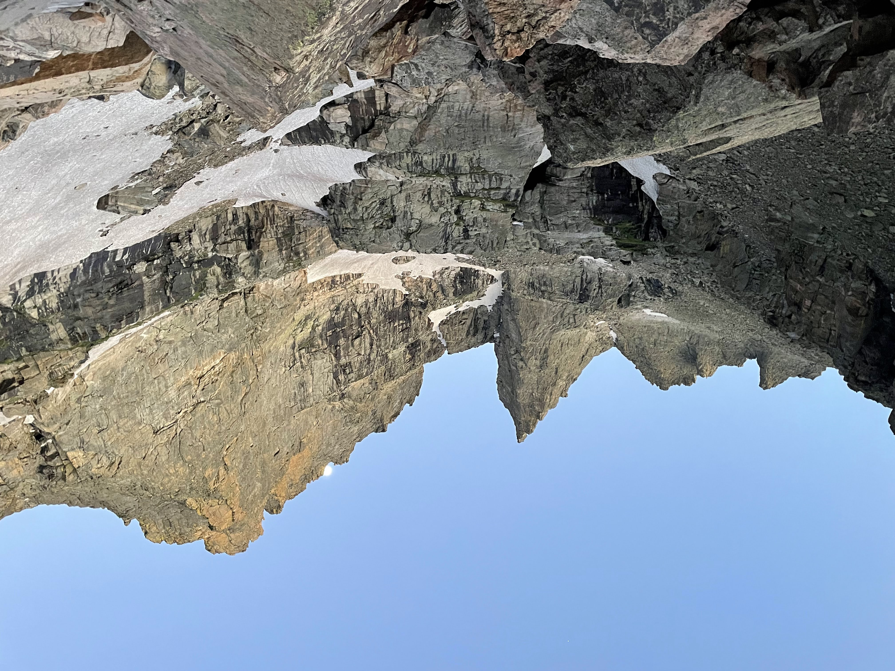

## Trip Reports

I am an avid rock climber and occasional alpinist. I've climbed in 12 US states plus Mexico, tallying over 1,000 pitches of rock since I began outdoor climbing in 2019. Below, I've listed all of my current trip reports, some of which are published elsewhere online.

```{=html}
<div class="card mb-3">
  <h3 class="card-header">Alpine Climbing in the North Cascades</h3>
  <div class="card-body">
    <h5 class="card-title">July 10-15, 2025</h5>
    <h6 class="card-subtitle text-muted">Status: Published in ECP Newsletter</h6>
  </div>
  <div class="card-body">
    <p class="card-text">
    Over a long weekend in July 2025, six ECP’ers convened for an alpine climbing trip in the Washington Pass area of North Cascades National Park. While other ECP’ers were in the region with eyes on Mount Shuksan, our objective was determined based on a general interest in sampling the alpine granite that was known to exist on the eastern side of the park. Ultimately, we found that some of the rock in Washington Pass was less than excellent–while most of the faces were stellar and awe-inspiring, we encountered plenty of questionable flakes, pillars, and rubble piles. The trip was an overall success with every climber tagging at least two summits in the vicinity of the famous “Liberty Bell” group. Several injuries occurred, but these were relatively minor and did not stop the injured members from climbing until the completion of the trip.
    </p>
  </div>
  <ul class="list-group list-group-flush">
    <li class="list-group-item">Partners: Drew G., Monica D., Scott C.</li>
    <li class="list-group-item">Routes: Beckey Route (5.6, II), Tunnel Route (5.8, II), The Hitchhiker (5.11-, IV)</li>
  </ul>
  <div class="card-body">
    <a href="portfolio/2025-08-ECP-Newsletter-Excerpt.pdf" class="card-link">Link to Full Trip Report</a>
  </div>
  <div class="card-footer text-muted">
    Published
  </div>
</div>
```

```{=html}
<div class="card mb-3">
  <h3 class="card-header">Alpine Training in West Virginia's Wilderness</h3>
  <div class="card-body">
    <h5 class="card-title">December 15, 2023</h5>
    <h6 class="card-subtitle text-muted">Status: Draft</h6>
  </div>
  <div class="card-body">
    <p class="card-text">
    An outing with the Explorer's Club of Pittsburgh. We hiked through the night to reach our rock climbing objective at Seneca Rocks, WV. We summitted and bivied atop the rocks.
    </p>
  </div>
  <ul class="list-group list-group-flush">
    <li class="list-group-item">Partners: Evren G., Dan M.</li>
    <li class="list-group-item">Route: Old Man's (5.3)</li>
  </ul>
  <div class="card-body">
    <a href="https://docs.google.com/document/d/e/2PACX-1vSZauGIJFXF2jLoW-fTkqXOIIe2URjdsNjREkNfeHRlQkjdlUbwgXoGhFeuuToh0DCYfxjN4U6AHEt7/pub" class="card-link">Link to Draft Trip Report</a>
  </div>
  <div class="card-footer text-muted">
    Unpublished
  </div>
</div>
```

```{=html}
<div class="card mb-3">
  <h3 class="card-header">Climbing the Sharkstooth of Rocky Mountain NP</h3>
  <div class="card-body">
    <h5 class="card-title">July 17, 2022</h5>
    <h6 class="card-subtitle text-muted">Status: Published</h6>
  </div>
  
  </img>
  <div class="card-body">
    <p class="card-text">
    A day-long adventure in Colorado's most famous national park. We encountered a steep snow field on our approach to the Sharkstooth Ridge.
    </p>
  </div>
  <ul class="list-group list-group-flush">
    <li class="list-group-item">Partner: Jason K.</li>
    <li class="list-group-item">Route: Northeast Ridge (5.6, II)</li>
  </ul>
  <div class="card-body">
    <a href="https://www.14ers.com/php14ers/tripreport.php?trip=22485" class="card-link">Link to Full Trip Report</a>
  </div>
  <div class="card-footer text-muted">
    Published 02/08/2024
  </div>
</div>
```

```{=html}
<div class="card mb-3">
  <h3 class="card-header">Summiting the Grand Teton via Exum Ridge</h3>
  <div class="card-body">
    <h5 class="card-title">August 12, 2021</h5>
    <h6 class="card-subtitle text-muted">Status: Draft</h6>
  </div>
  <div class="card-body">
    <p class="card-text">
    My first real mountaineering trip, in which I climbed the Grand Teton using a classic rock climbing route to the summit.
    </p>
  </div>
  <ul class="list-group list-group-flush">
    <li class="list-group-item">Partner: Donnie K.</li>
    <li class="list-group-item">Route: Exum Ridge (5.5, III)</li>
  </ul>
  <div class="card-body">
    <a href="https://docs.google.com/document/d/e/2PACX-1vRqXtRpEbvU42-6EtdEUbRAv947dCRpbimIO8Y2UStIqlXm5QTaRJHXKG1NX4rBuxGm6cjiqI7BVQqW/pub" class="card-link">Link to Draft Trip Report</a>
  </div>
  <div class="card-footer text-muted">
    Unpublished
  </div>
</div>
```

## Photography

I am beginning to share some of my photos from rock climbing adventures.

```{=html}
<a href="/wv-24-gallery.html"</a>Fall in West Virginia, 2024</a>
```