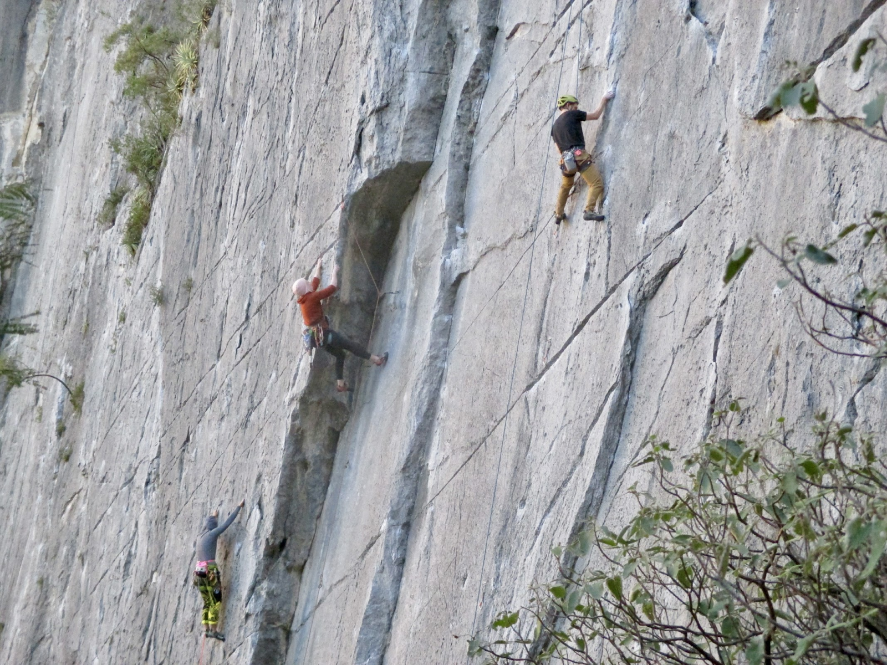

## Overview

From December 28, 2025 through January 5, 2026, I co-led a ten-person climbing trip to Mexico. A few of us on the trip were current or former ECP’ers–including myself, Saul Schaffer, Monica Dayao, Drew McNutt, and Drew Gallagher. We spent eight days in Hidalgo, Nuevo Leon, just a ten minute walk from El Potrero Chico. This renowned park is home to multiple, thousand-foot walls and hundreds of bolted rock climbs. The trip was a resounding success and our group bonded over many triumphs and challenges of climbing in another country.

[Published in ECP Newsletter](../../portfolio/2026-03-ECP-Newsletter-Excerpt.pdf) (March 2026)

Partners: Malini S., Drew G., Drew M., Lora W., et al.

