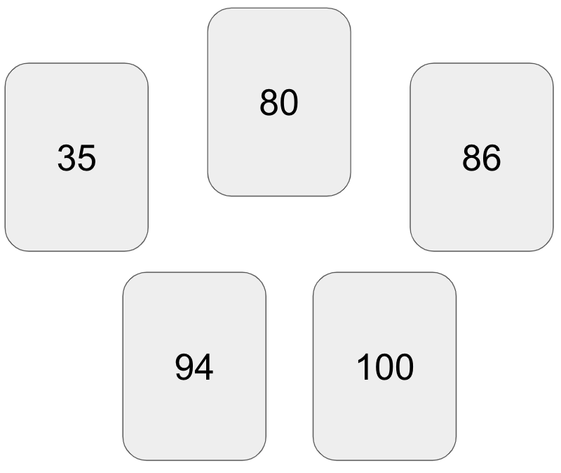

```{r}
#| echo: false
#| message: false
library(data.table)
library(Hmisc)
options(digits=3) 
```

I was at a friend's house for game night last weekend, and I was introduced to a game called [The Mind](https://en.wikipedia.org/wiki/The_Mind_(card_game)#Gameplay). The premise is simple; a deck of cards is numbered one through one hundred, each player is dealt a card, and the object is to work cooperatively to play cards in ascending order, *without communication*.[^1] For example, a hypothetical round with five players may begin like this:

{width=50%}

The funny bit of this game is the dilemma that one inevitably faces when deciding whether to play one's card because it is *close* to the current card laying face-up. Another player may silently be holding onto a card that is *closer* in number, and everyone is faced with a decision to act or not.

I was allured by the question, *What's the average difference between cards?* At this point in the night there were five of us playing, each with one card from the deck of one-hundred.

For simplicity let's assume the round has just begun and there are five cards in play. The instinctual response is that the average difference is $20$, because there are $N=5$ players and $K=100$ cards; take $\frac{K}{N}=\frac{100}{5}$ which yields $20$. This was the first answer I got when I posed it to the group, and the answer  I think would be most common in a straw poll of casual players. I considered it at first, but then reconsidered.

Here is the difficulty with that answer (and anyone familiar with *The Mind* can anecdotally attest to this), the randomly-dealt cards tend to be clustered *closer* to one another than in a uniformly-dealt deck. As counter-intuitive as that may sound, the difference between consecutive cards tends to be *smaller* than twenty.

I was struggling to explain this to my friends at the game night and I wanted desperately to run a simulation in `R` to come up with an estimate of the average consecutive difference, which I'll denote $\bar{\Delta}_{5,1}$, with the subscript "5,1" indicating there are five players each holding one card.

## Pre-round Simulation

Now that I'm able to run a simulation at home, we can show that $\bar{\Delta}_{5,1}<20$, at least at the beginning of the round before any cards have been played. Our strategy is to simulate many hypothetical "rounds" and then compute $\bar{\delta}_{5,1}$ for each one until we have enough simulations to consider the average a stable estimate of $\bar{\Delta}_{5,1}$.

Let's begin with just one round. In `R`, it is easy to code this up:

```{r}
set.seed(1818)
deck <- 1:100
deal <- sample(deck, size=5, replace=FALSE)
printL("Hypothetical round of cards"=sort(deal))
```

One can try this on their own computer and the result will be the same, as long as the random seed `1818` is used.

Next, we will compute the average difference between cards in this round:

```{r}
d.bar <- mean(diff(sort(deal)))
printL("Average difference between cards in round"=d.bar)
```

Remember, this is only a single round, but it corroborates the claim that $\bar{\Delta}_{5,1}<20$. To conclude this with more certainty, we must simulate many hypothetical "rounds". In the code below I simulate 10,000 rounds of a five-player game, and compute $\bar{\delta}_{5,1}$ at the start of each round, then examine a plot of their distribution:

```{r}
#| label: fig-pre-round-histogram
#| fig-cap: "Distribution of $\\bar{\\delta}_{5,1}$ over 10,000 simulations"
#| fig-cap-location: top
d.bar.51 <- replicate(
  10000,
  {
    deal <- sample(deck, size=5, replace=FALSE)
    mean(diff(sort(deal)))
  })
D.bar.51 <- mean(d.bar.51)
hist(d.bar.51, xlab="Average Consecutive Difference, 5 cards", main=NA)
abline(v=D.bar.51, col="blue", lty=2)
mtext(paste0("Average, in blue: ", format(D.bar.51, digits=3)))
```

The resulting average of 10,000 simulations, `r format(D.bar.51, digits=3)`, is depicted with the blue vertical line. This estimate is not far off from that of the single round we simulated, though we should give more credence to the average over many simulations. It is not as sensitive to noise that might result in a single deal of the deck.

## Mid-round Simulation

Later I recognized that the answer `r format(D.bar.51, digits=3)` is not all that useful, if you are playing the game already. The reason can be seen in the spread of the distribution in @fig-pre-round-histogram. Across many rounds, the average difference between cards may be as little as 5, or it may be as great as 25. The chance of a round with an average difference beyond these limits is very small, just `r format(mean(d.bar.51<5 |  d.bar.51> 25), digits=3)`.

However, if you have seen one of the cards dealt, you possess some information that can be useful. To illustrate this more intuitively, consider that each player only knows the value of their card at the start of the round; in a five-player game that's just 20% of the knowledge available. After a card is played, that knowledge increases to 40% for each player. Given that we've seen one card, what is the average difference between the cards in play?

Computing an answer to this question requires a slight modification to our code, but it is still achievable without too much difficulty. In the code below, I simulate another 10,000 rounds, only this time, I keep track of the lowest card (which would be the first card played), as well as the average difference between cards. In contrast to the earlier simulation, there are now two quantities to track: the lowest card in the round, $\text{min}(X_i)\quad \text{for}\ i=1, ...,5$ and the average difference, $\bar{\delta}_{5,1}$.

```{r}
one.card.played <- replicate(
  10000,
  {
    deal <- sample(deck, size=5, replace=FALSE)
    list("xMin"=min(deal), "dBar"=mean(diff(sort(deal))))
  })
printL("Lowest card, on average"=mean(unlist(one.card.played["xMin",])))
```

[Interestingly, the average value of the lowest card is `r format(mean(unlist(one.card.played["xMin",])), digits=3)`, which is *also* the average difference between cards. This is not a coincidence; it arises from the fact that the value of the first card minus zero is a "difference" in itself.]{.aside}

The results of the simulation require some work to visualize. Let's examine a plot with two axes; the horizontal axis is the value of the lowest card played. The vertical axis is the average difference among the cards in the round. Each point in the plot represents one simulated "round", out of 10,000:

```{r}
#| label: fig-mid-round-histogram
#| fig-cap: "Lowest card versus $\\bar{\\delta}_{5,1}$ over 10,000 simulations"
#| fig-cap-location: top
#| echo: false
plot(unlist(one.card.played["xMin",]), unlist(one.card.played["dBar",]),
     pch=16, cex=0.5, xlab="Lowest card", ylab="Average difference")
```

From the above plot, looking left to right, it's apparent that the higher the value of the lowest card, the smaller the difference between cards. This makes intuitive sense, because the remaining cards must be spread across the numbers $\text{min}(X_i)+1, \text{min}(X_i)+2, ..., 100$.

Finally, our goal is to summarize these results into a convenient form. It's obviously not pragmatic to run a simulation after seeing the first card played during a live game. Instead, it might be useful to know the general shape of the relationship between the two variables, illustrated in @fig-mid-round-histogram. To do this, we examine the average consecutive difference in cards ($\bar{\delta}_{5,1}$), *conditional* on the knowledge that the lowest card is within some window of ten numbers:

```{r}
#| echo: false
#| label: tab-mid-round-conditioning
#| tbl-cap: "Mid-round conditioning of $\\bar{\\delta}_{5,1}$ given lowest card"
res <- data.table(LowestCard=unlist(one.card.played["xMin", ]),
                  AvgDiff=unlist(one.card.played["dBar", ]))
res[, LowestCard:=cut(LowestCard, seq(0, 100, 10),
                   labels=paste(seq(1, 91, 10), seq(10, 100, 10), sep=" - "))]
tab <- res[, .(AvgDiff=mean(AvgDiff), StdErr=sd(AvgDiff)/.N), by=LowestCard]
tab[order(LowestCard), .(LowestCard, AvgDiff, StdErr, Reliability=log(1/StdErr))]
```

There are a few takeaways from the results in the table above. First, the simulated average difference between cards declines from a maximum around 19, to a minimum around 3, depending on the value of the lowest card played. Therefore, at the start of the round, players can gain information from each other by interpreting the first card as a signal, despite the lack of communication.

Second, the reliability of our estimates, measured as $\text{log}(\frac{1}{\text{SE}(\bar{\delta})})$, declines with increasing values of the lowest card. This is due to the fact that fewer simulated scenarios resulted in low cards with high values; the probability of a deal with a low card of 50 is much smaller than the probability of a deal with a low card of 10. This just means that our estimates are not equally precise; we might need to simulate additional information to attain more reliable results for the rounds with a lowest cards above fifty, for instance.

## Conclusion and Closing Thoughts

In this brief foray into board game simulation, I analyzed basic properties of a game with simple rules and cooperative strategy. I sought to quantify the expected value of the difference in numerical values of cards in play. I focused on the simplified scenario where each player only possesses one card, though the same techniques could be extended to analyze properties of other scenarios. I also simulated mid-round circumstances to analyze the effect on the average difference between consecutive cards, which I denoted $\bar{\Delta}_{5,1}$.

Further, I suspect that a complete distribution of $\bar{\Delta}_{5,1}|\text{min}(X_i)$ could be derived analytically or via more advanced simulation methods. One could generalize to many different game circumstances, although computation time may be burdensome. At the end of the day (or the round), it's just fun to apply probability and statistics to real-world scenarios, however contrived they may be.

[^1]: The game increases in complexity with every round but the general premise remains the same; cards are sequentially added to each player's hand and there is a variation where players have "lives" to use, should they mistakenly play a card out of turn.