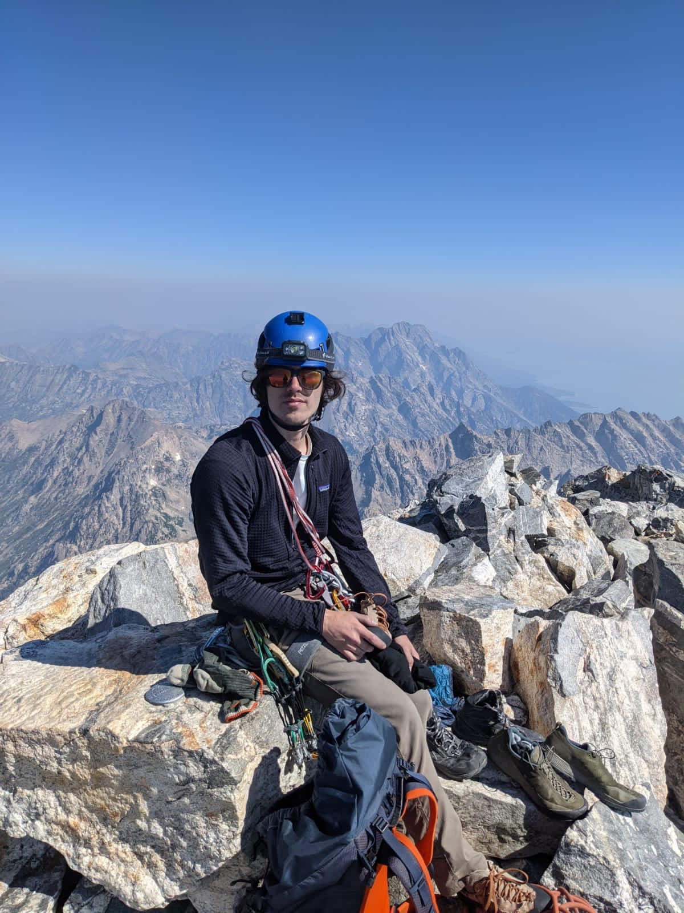
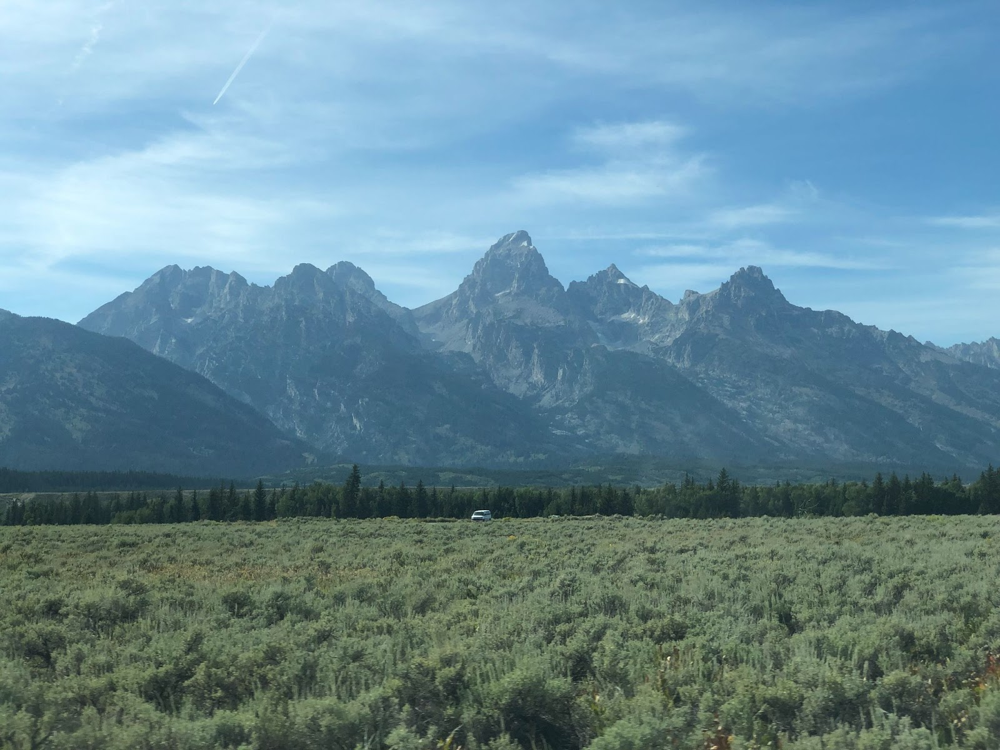
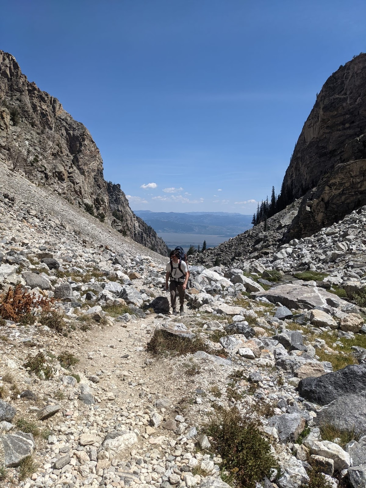
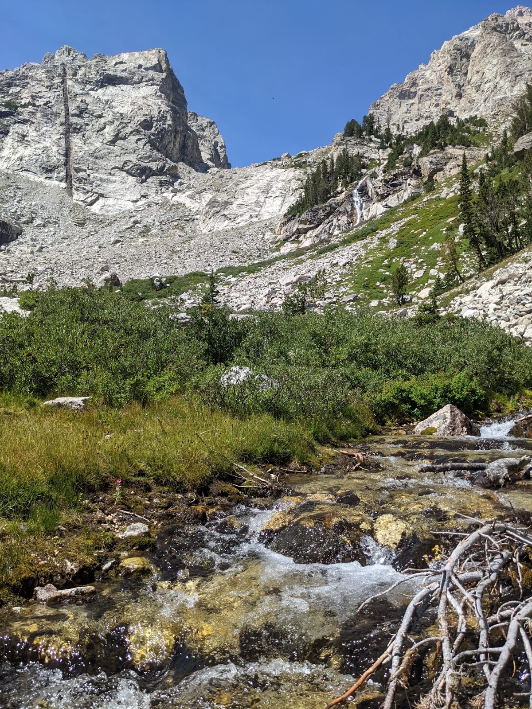
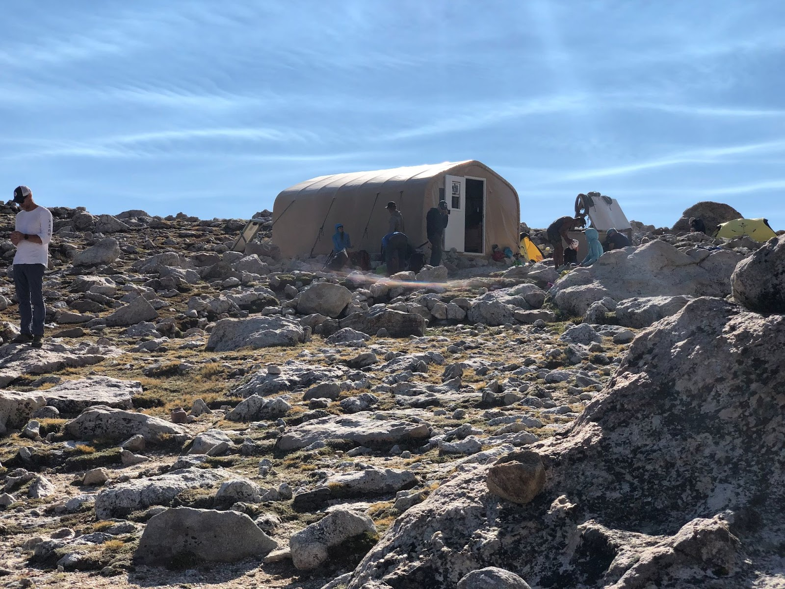
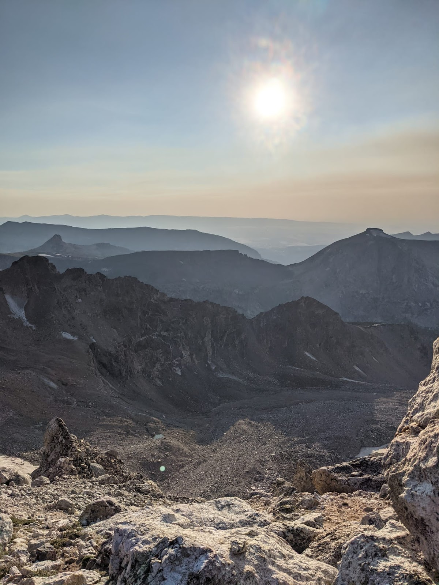
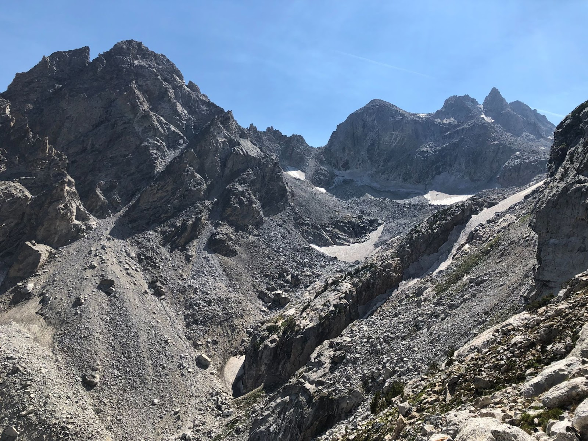

## Synopsis

My first real mountaineering trip, in which I summitted the Grand Teton using a classic rock climbing route (Exum Ridge 5.5, III).

Dates: August 12-13, 2021

Partner: Donnie K.

Total car-to-car time: 32 hours, 20 mins

## Planning

As this was my first alpine route, I researched the ascent heavily. I used the following site to get a lot of details about the route: <http://wyomingwhiskey.blogspot.com/p/grand-teton.html?m=1>

The climbing rangers’ blog is also useful: <http://tetonclimbing.blogspot.com/?m=1>

I did not research the descent heavily, which was a mistake. Luckily we met a group on the summit who knew the descent well.

Obtaining a backcountry permit was stressful as we had to be in the park before 8am to wait in line at Jenny Lake Ranger Station. We lucked out and got a permit at the Lower Saddle, our second choice (first choice was the Moraines campsite).

## Approach

The approach through Garnet Canyon is relentlessly uphill and rocky.
Perhaps it was fortuitous that neither of us had climbed in the alpine before, because we had no comparison for the brutal uphill approach. We left the Lupine Meadows trailhead at 10:43am. Our packs were full of gear, food, and water. I understand why people have given the approach its reputation, and a light-and-fast tactic would be far less grueling (although riskier).

In all it took us 7 hours and 3 minutes to reach the Lower Saddle.

## Climbing

We started early the next day, around 4am. I was worried to see many guided parties heading up from the Lower Saddle at the same time, but the crowds thinned out as we turned towards Wall Street ledge (the start of Upper Exum). Route finding was continuously challenging. Several times we were standing on ledges, after having climbed and scrambled a rope length or two, and finding ourselves perplexed as to where the route went. In retrospect, this seems a common alpine experience. We lucked out by seeing another party in front of us once or twice, asking them for beta whenever I could. We found the V-pitch this way.

The climbing was fun but the discontinuity was annoying. I was aware of this before we got up there, but I did not fully understand what the terrain was like until we were midway up the route. For the most part, 5th class moves were easy, and sometimes exposed. The ‘Boulder Problem in the Sky’ was memorable and it was the last real 5th class climbing on the whole route.

## Descent

After hobbling to the summit around 11am, we sat and rested as the only party there. Then several soloists and one roped party came up the Owen Spalding. We recognized the roped party as a group of girls we passed on the approach the day before. The leader, Amber, was much more informed about the descent than me so we followed them down. There were one or two rappels, and some exposed downclimbing in one memorable spot. Descent from the Upper Saddle was tiring and steep. Donnie and I both had stinging headaches from the altitude. This made the challenging terrain more frustrating. Coming down from the Lower Saddle was long and treacherous. At least once we got off trail and found ourselves on steep scree slopes. I slipped and fell several times. Traversing the scree to get back on trail was irritating and scary (it seemed like you could lose control and slip >50 feet down the scree).

I could've been better prepared for this descent. Trekking poles would've been immensely helpful. Trail-running some steep hikes around Boulder would’ve been good training. But there’s something unique and alluring about the feeling of tiredness, wariness, and euphoria that ensues when you find yourself lost in Garnett Canyon on a descent of the Grand.

## Hazards encountered

* Rocky, loose terrain in many places
* Falling rock 
* Steep scree fields
* Glaciers (although snow travel not required)
* Ice (on Owen Spalding)
* Other climbing parties

Lessons Learned:

1. Research alpine descents heavily, including rappel routes and trail landmarks
2. Train for alpine hiking with heavy pack on downhill terrain
3. Efficiency can be gained by speeding up transitions between climbing and scrambling

