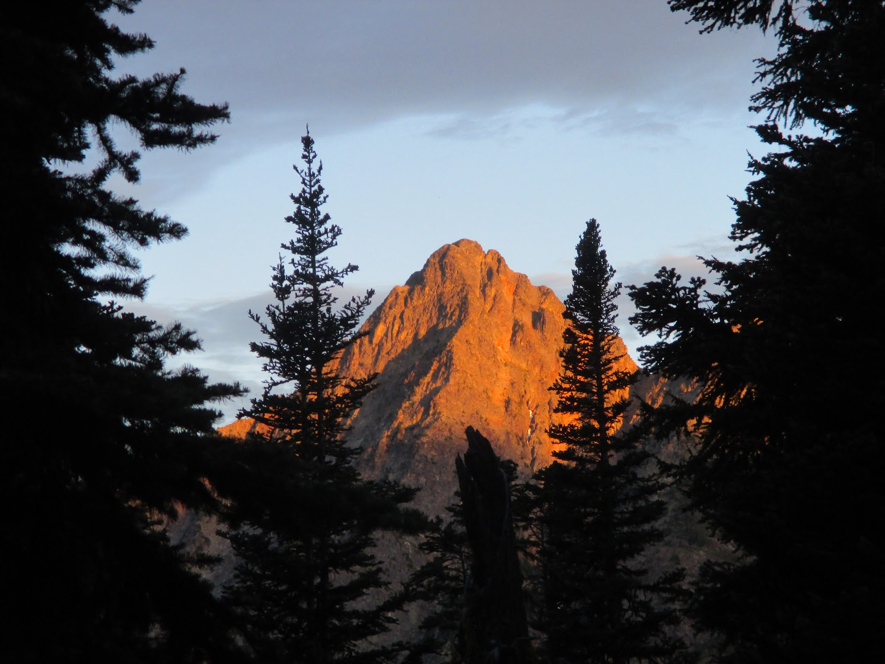

## Overview

Over a long weekend in July 2025, six ECP’ers convened for an alpine climbing trip in the Washington Pass area of North Cascades National Park. While other ECP’ers were in the region with eyes on Mount Shuksan, our objective was determined based on a general interest in sampling the alpine granite that was known to exist on the eastern side of the park. Ultimately, we found that some of the rock in Washington Pass was less than excellent–while most of the faces were stellar and awe-inspiring, we encountered plenty of questionable flakes, pillars, and rubble piles. The trip was an overall success with every climber tagging at least two summits in the vicinity of the famous “Liberty Bell” group. Several injuries occurred, but these were relatively minor and did not stop the injured members from climbing until the completion of the trip.

[Published in ECP Newsletter](../../portfolio/2025-08-ECP-Newsletter-Excerpt.pdf) (August 2025)

Partners: Drew G., Monica D., Scott C.

Routes: Beckey Route (5.6, II), Tunnel Route (5.8, II), The Hitchhiker (5.11-, IV)

