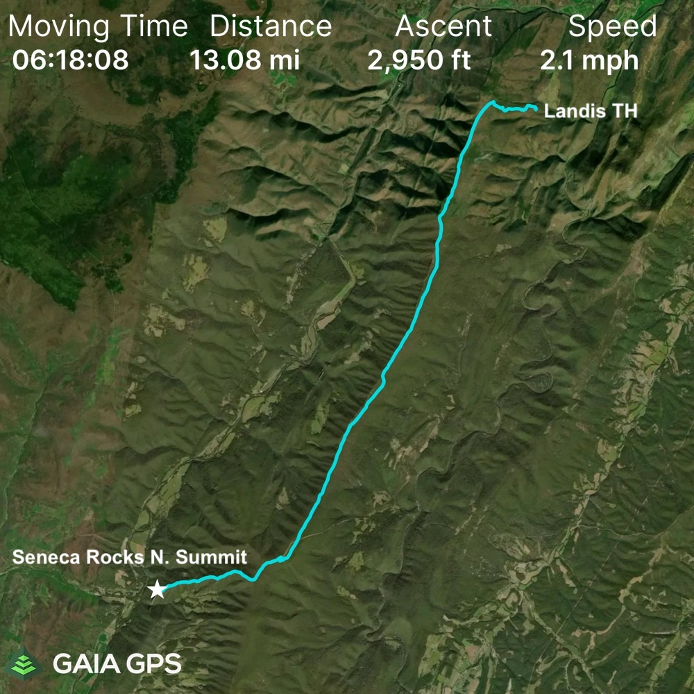
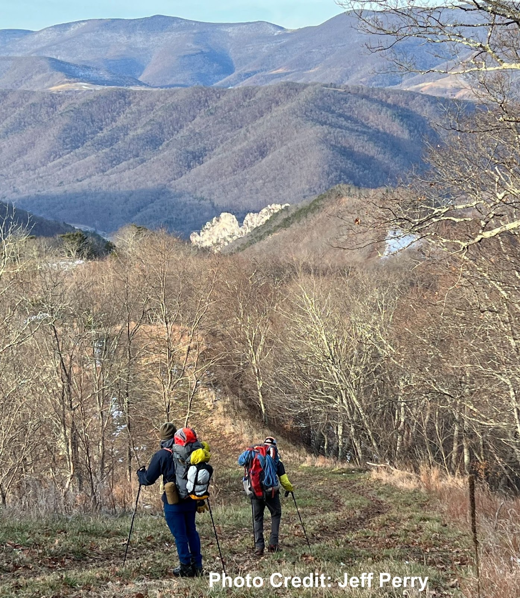
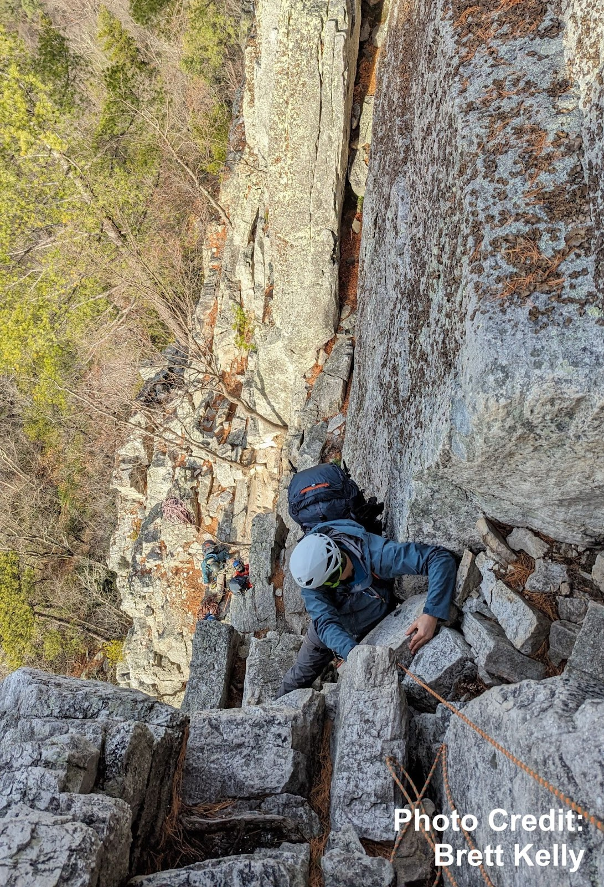
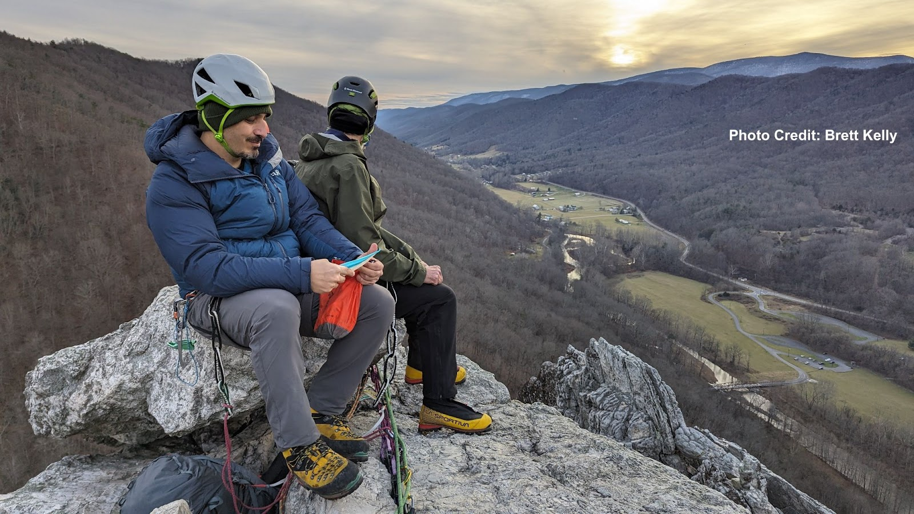

## Overview

In one of my first Winter Mountaineering outings with the Explorer's Club of Pittsbugh (ECP), we hiked through the night to simulate an alpine rock climbing objective--only we were in West Virginia, and the rock we aimed to climb was actually lower in elevation than our trailhead. We summitted the next morning and bivied atop the rocks.

## The Approach

We left Princess Snowbird campground around 1am and arrived at the trailhead by 01:30. I was very cold particularly in my feet. We had a huge hike ahead of us so I anticipated warming up soon. One mistake, though, was leaving on my shell layers in the beginning of the hike. We climbed steadily uphill gaining 1,000 feet of elevation, and I was sweating intensely. The shell layers prevented me from drying out, so when we gained the North Fork trail and the terrain flattened out, I was still damp underneath my outer layers. This made stopping for longer periods somewhat dangerous, as the air temperature was in the low 30s and staying wet in that kind of cold can lead to hypothermia. I was lucky that the group did not need extra long breaks.

The approach took about 8 hours (including breaks) until we reached the observation deck at Seneca’s North Summit. Some of the highlights included watching the sun rise to the east over Smokehole Canyon. Additionally, we gained the top of the ridge with dropoffs to either side, which made the early morning hike more exhilarating.

A few hurdles were the hunter access road, which was relentlessly uphill and semi-paved, as well as the pipeline descent, which was steep and dusted in snow. Conditions were very favorable. If there had been more precipitation in the past week, descending the pipeline would have been very challenging.

Coming down the pipeline, I was thankful to spot the familiar gun sight of Seneca Rocks. The white cliffs stood out brightly in the morning sunlight. But I had never seen them from this angle, as I normally approached the climbing from the West side of town. One of the peculiar aspects of this trip was that we were descending towards the climbing (typically, in alpine terrain, one would ascend towards a climbing objective).

Then we had the challenge of descending down to the West face to access our climbing route, all while continuing to carry our 30-pound packs. The crux of this descent was the fact that we needed water from Roy Gap Run, which runs continually through the Winter, but is located south of the rocks. So Dan and I hiked down the ‘Stairmaster’ trail to the stream, while Evren watched our gear at the base of the climb. In retrospect I’m not convinced that this detour was absolutely necessary. For one, we had already planned on a dry breakfast the next morning since rain was expected early. Also, the three of us had several liters of water between us and knew that we wouldn’t need a lot more to cook dinner for the evening. So I would advise each team member to bring three liters of water (or 2L plus a 20oz gatorade), which should leave everyone with about a liter by the time the team reaches the summit. However if conditions are worse, I expect that more water would be needed, so there is definitely a tradeoff in this strategy.

The climbing itself was engaging and fun. I enjoyed the challenge of leading while climbing in mountaineering boots, with a heavy pack on, too. I probably wouldn’t want to climb much harder than the route we took (which is rated at 5.2 but climbs more like 5.5). Again we were aided by favorable conditions. If the rock were colder, or if there was any recent precipitation, I think we might’ve bailed on the climbing.

We began the route shortly after noon, and arrived at the top of the third pitch by 16:00. We were slowed down a little by the party in front of us, but I’m not sure we would’ve been much faster as a team of three. Evren’s knee was hurting, so his job of cleaning the gear became more challenging. Some of our rope management skills could improve, as a few times we had to creatively get Dan untangled (he was the climber tied into both ropes).

Here is a list of all of the climbing gear I brought in my pack:

- Doubles of 0.5 - #2, single #3, single #4, single totems black - yellow
- Nine single-length runners with racking carabiners
- Two double-length runners
- Two cordelette/quad-length runners
- ATC guide with two lockers for belaying above
- Two Additional Lockers
- Prusik cord

I believe that Evren and Dan each had several lockers in addition to their belay devices. I didn’t feel that we were short on gear for this route, and I tried to place ample protection. I appreciated having the small cams, especially since I opted not to bring nuts. I’m sure if I practiced my nut placements I might be able to spare a good amount of weight by leaving cams at home. However I hadn’t done a ton of trad climbing in the few months leading up to this outing, so I wanted to keep things as simple as possible.

The bivy on the summit ridge was made difficult by limited space. I ended up choosing a spot by a tree, which offered plenty of protection from falling off the edge, but the terrain was slanted and I kept sliding in my bag throughout the night. This was very uncomfortable and I would not want to repeat that mistake.

The next morning, I linked up with Chantz and Steevo and we did a full-length 70 meter rappel from the Conn’s West anchors, which allowed us to reach the ground in one go. I don’t know when I’ll ever have two 70m ropes at my disposal again, but this was definitely convenient and fast. While standing at the Conn’s West anchors, I needed to extend my personal tether, so I just used a non-locking carabiner from one of my runners. Steevo later pointed out that I was trusting my life to this one ‘biner, and I thanked him for the constructive feedback. He is right. Although I did not feel particularly exposed while standing on the relatively large ledge, I should not get in the habit of clipping in direct with a single non-locking carabiner. Room for improvement.

